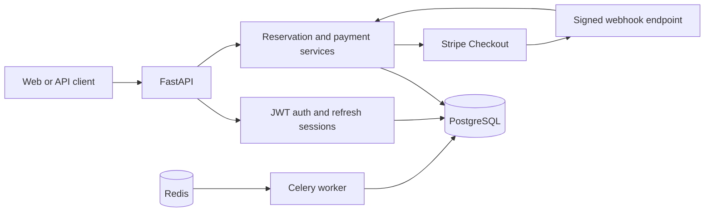

# Event Ticketing API

[](https://github.com/taras-maleryk/event-ticketing/actions/workflows/ci.yml)
[](#tests-and-quality-checks)


An asynchronous backend for event discovery, seat reservation, and Stripe-powered
ticket checkout. The project focuses on the difficult parts of ticketing systems:
concurrent seat holds, idempotent payment creation, out-of-order webhooks, and
transactional consistency.

The API is built with FastAPI, SQLAlchemy 2.0, PostgreSQL, Stripe, Celery, and
Redis. It includes database migrations, structured request and payment logging,
role-based access control, and an integration test suite with real PostgreSQL
concurrency scenarios.

## Highlights

- Event catalogue with pagination, date filters, and upcoming/past views.
- Organizer-managed events and configurable seat layouts with row-level pricing.
- Per-user seat availability: available, held, held by me, booked, or booked by me.
- Time-limited seat holds protected by a PostgreSQL exclusion constraint.
- Stripe Checkout with stable idempotency keys and persisted payment attempts.
- Signed, deduplicated Stripe webhooks with explicit payment state transitions.
- Transactional booking creation using row locks and database uniqueness rules.
- JWT access and refresh tokens delivered through HttpOnly cookies.
- Database-backed refresh sessions with token rotation, replay protection, and
  logout revocation.
- Argon2 password hashing and role-based authorization.
- Structured console or JSON logs with request and correlation IDs.
- Unit, integration, and concurrency tests executed in GitHub Actions.

## System overview



### Reservation and payment flow

1. An organizer creates an event and generates its seat layout.
2. An authenticated user places a time-limited hold on an available seat.
3. PostgreSQL rejects overlapping holds even when requests arrive concurrently.
4. Checkout creates or reuses one active payment attempt and extends the hold to
   cover the Stripe Checkout lifetime.
5. Stripe receives a deterministic idempotency key based on the payment attempt.
6. The signed webhook locks the payment attempt, verifies its state, amount,
   currency, and Checkout Session, then creates the booking transactionally.
7. Duplicate or out-of-order webhook events are safely ignored.

### Seat-hold transaction

```text
BEGIN
  -> verify that the seat has not already been booked
  -> insert a time-bounded hold
  -> let PostgreSQL reject an overlapping hold interval
  -> verify booking state again before commit
COMMIT
```

The database, rather than request timing in Python, is the final authority on
whether concurrent users can hold the same seat.

Additional rules keep the reservation lifecycle consistent:

- `held_until` determines whether a hold is active;
- a booked seat cannot be held again;
- an existing active payment attempt is reused instead of duplicated;
- checkout extends the hold so it cannot expire while Stripe is still accepting
  payment;
- webhook amount and currency must match the stored payment snapshot before a
  booking is created.

## Technology stack

| Area | Technology |
| --- | --- |
| API | FastAPI, Pydantic v2, Uvicorn |
| Database | PostgreSQL 16, SQLAlchemy 2.0, asyncpg, psycopg |
| Migrations | Alembic |
| Authentication | JWT, Argon2, HttpOnly cookies |
| Payments | Stripe Checkout and webhooks |
| Background work | Celery and Redis |
| Observability | structlog, request/correlation IDs |
| Quality | pytest, pytest-asyncio, Ruff, mypy |
| Delivery | Docker Compose, GitHub Actions |

## Getting started with Docker

### Prerequisites

- Docker with Docker Compose
- A Stripe test account for the checkout and webhook flow
- Stripe CLI if you want to forward webhooks locally

### 1. Clone and configure

```bash
git clone https://github.com/taras-maleryk/event-ticketing.git
cd event-ticketing
cp .env.docker.example .env.docker
```

Replace the placeholder values in `.env.docker`, especially:

- `POSTGRES_PASSWORD`
- `SECRET_KEY`
- `STRIPE_SECRET_KEY`
- `STRIPE_WEBHOOK_SECRET`

Generate a suitable local JWT secret with:

```bash
python -c "import secrets; print(secrets.token_urlsafe(48))"
```

### 2. Start the stack

```bash
docker compose up -d --build
docker compose ps
curl http://localhost:8000/
```

Compose starts PostgreSQL, Redis, applies Alembic migrations, and then starts the
API, Celery worker, and Celery Beat scheduler.

| Service | Address |
| --- | --- |
| Swagger UI | <http://localhost:8000/docs> |
| ReDoc | <http://localhost:8000/redoc> |
| API root | <http://localhost:8000/> |
| PostgreSQL | `localhost:5432` |
| Redis | `localhost:6379` |

Stop the stack without deleting its data:

```bash
docker compose down
```

Add `-v` only when you intentionally want to delete the local PostgreSQL volume.

### 3. Forward Stripe webhooks

In another terminal:

```bash
stripe listen --forward-to localhost:8000/api/webhooks/stripe
```

Copy the webhook signing secret printed by Stripe CLI to
`STRIPE_WEBHOOK_SECRET`, then restart the API.

Celery Beat schedules the daily cleanup of old holds automatically as part of
the Compose stack.

## Local development

### Prerequisites

- Python 3.12
- PostgreSQL 16
- Redis 7

Create the development and test databases referenced by your connection URLs,
then install the application:

```bash
python3.12 -m venv .venv
source .venv/bin/activate
python -m pip install --upgrade pip
pip install -r requirements.txt
cp .env.example .env
```

Update `.env` with your local database credentials and Stripe test keys. Apply
the schema and start the API:

```bash
alembic upgrade head
uvicorn app.main:app --reload
```

Start Redis, a Celery worker, and Celery Beat when working locally with
background tasks:

```bash
celery -A app.core.celery_app.celery_app worker --loglevel=info
celery -A app.core.celery_app.celery_app beat --loglevel=info
```

## Configuration

All settings are read from environment variables. The complete development and
Docker templates are available in `.env.example` and `.env.docker.example`.

| Variable | Purpose |
| --- | --- |
| `DATABASE_URL` | Async SQLAlchemy connection URL |
| `SYNC_DATABASE_URL` | Synchronous connection used by Celery tasks |
| `TEST_DATABASE_URL` | Dedicated test database; its name must end in `_test` |
| `REDIS_URL` | Celery broker URL |
| `SECRET_KEY` | JWT signing secret |
| `STRIPE_SECRET_KEY` | Stripe API secret key |
| `STRIPE_WEBHOOK_SECRET` | Stripe webhook signature secret |
| `STRIPE_SUCCESS_URL` | Checkout success redirect URL |
| `STRIPE_CANCEL_URL` | Checkout cancellation redirect URL |
| `HOLD_FOR_MINUTES` | Initial seat hold lifetime |
| `ACCESS_TOKEN_EXPIRE_MINUTES` | Access-token lifetime |
| `REFRESH_TOKEN_EXPIRE_DAYS` | Refresh-session lifetime |
| `CORS_ALLOWED_ORIGINS` | JSON array of frontend origins allowed to send credentialed requests |
| `LOG_FORMAT` | `console` for development or `json` for structured logs |

Never commit real secrets. The checked-in environment files contain placeholders
only.

## API overview

All application endpoints are under `/api`.

| Method | Endpoint | Access | Description |
| --- | --- | --- | --- |
| `POST` | `/auth/register` | Public | Register a regular user |
| `POST` | `/auth/login` | Public | Authenticate and issue token cookies |
| `POST` | `/auth/refresh` | Refresh cookie | Rotate the refresh token |
| `POST` | `/auth/logout` | Public | Revoke the current refresh session and clear cookies |
| `GET` | `/events` | Public | List and filter events |
| `GET` | `/events/{event_id}` | Public | Get event details |
| `GET` | `/events/{event_id}/seats` | User | Get user-aware seat availability |
| `POST` | `/events` | Organizer | Create an event |
| `PATCH` | `/events/{event_id}` | Owner organizer | Update an event |
| `POST` | `/events/{event_id}/seats` | Owner organizer | Generate the seat layout |
| `POST` | `/seats/{seat_id}/hold` | User | Hold a seat |
| `DELETE` | `/seats/{seat_id}/hold` | User | Release a hold without an active payment |
| `POST` | `/holds/{hold_id}/checkout-session` | User | Start or reuse Stripe Checkout |
| `GET` | `/payments/{payment_attempt_id}` | Owner user | Read payment status |
| `POST` | `/webhooks/stripe` | Stripe signature | Process Stripe events |

Public registration intentionally creates only regular users. Organizer accounts
are provisioned separately; for a local demo, register an account and assign the
`organizer` role directly in the development database.

## Example seat hold

With an event and seat layout already created, the complete user-side flow starts
by registering an account:

```bash
curl -X POST http://localhost:8000/api/auth/register \
  -H "Content-Type: application/json" \
  -d '{
    "name": "Demo User",
    "email": "demo@example.com",
    "password": "StrongPass123",
    "confirm_password": "StrongPass123"
  }'
```

Log in and store the HttpOnly cookies returned by the API:

```bash
curl -c cookies.txt -X POST http://localhost:8000/api/auth/login \
  -H "Content-Type: application/x-www-form-urlencoded" \
  --data-urlencode "username=demo@example.com" \
  --data-urlencode "password=StrongPass123"
```

Hold an available seat:

```bash
curl -b cookies.txt -X POST http://localhost:8000/api/seats/1/hold
```

A competing request for the same seat receives `409 Conflict`. Use the returned
hold ID to start Stripe Checkout:

```bash
curl -b cookies.txt -X POST \
  http://localhost:8000/api/holds/1/checkout-session
```

The response contains a Stripe-hosted Checkout URL and its expiration time.

## Tests and quality checks

The test suite uses a dedicated PostgreSQL database because row locks, exclusion
constraints, and race behavior cannot be represented faithfully by an in-memory
database. Configure it through `TEST_DATABASE_URL`; as a safety measure, tests
refuse to run unless the database name ends in `_test`.

Run the same checks as CI:

```bash
ruff check app tests alembic
ruff format --check app tests alembic
mypy app
alembic upgrade head
pytest -q
```

The suite includes more than 100 unit and integration tests, including scenarios
for concurrent seat holds, payment-attempt reuse, webhook deduplication, payment
state transitions, token rotation, and refresh-token replay protection.

Current verified result:

```text
115 passed
```

CI also applies the full schema from scratch before running the test suite.

## Database migrations

Docker Compose applies migrations before starting the API. For local development,
inspect the current revision, upgrade the schema, and check model consistency with:

```bash
alembic current
alembic upgrade head
alembic check
```

Create an autogenerated revision after changing SQLAlchemy models:

```bash
alembic revision --autogenerate -m "describe the change"
```

## Data integrity and security decisions

- PostgreSQL `EXCLUDE USING gist` prevents overlapping hold intervals for a seat.
- A unique constraint ensures that a seat can have only one booking.
- `SELECT ... FOR UPDATE` serializes sensitive hold, payment, and refresh-session
  transitions.
- Stripe event IDs are persisted and inserted with conflict handling for webhook
  idempotency.
- Payment amount and currency are stored as snapshots and validated against the
  completed Stripe Checkout Session.
- Invalid or late payment state transitions cannot create a booking.
- Refresh tokens are rotated on use; replayed and revoked tokens are rejected.
- Passwords are hashed with Argon2 and are never returned by the API.
- Every HTTP response includes `X-Request-ID` and `X-Correlation-ID` headers.

## Project structure

```text
app/
├── core/          # settings, security, Stripe, Celery, and logging
├── db/            # async and synchronous SQLAlchemy sessions
├── middleware/    # request and correlation logging
├── models/        # SQLAlchemy models
├── routers/       # HTTP endpoints
├── schemas/       # request and response validation
├── services/      # payment and webhook business logic
└── tasks/         # Celery background tasks
alembic/           # database migrations
tests/             # unit, integration, and concurrency tests
```

## Author

**Taras Maleryk**

- GitHub: [@taras-maleryk](https://github.com/taras-maleryk)
